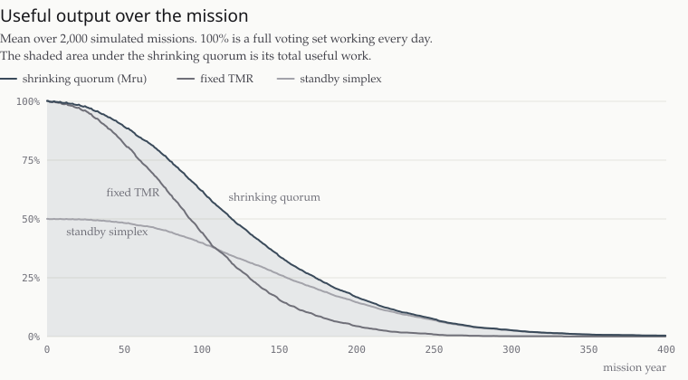
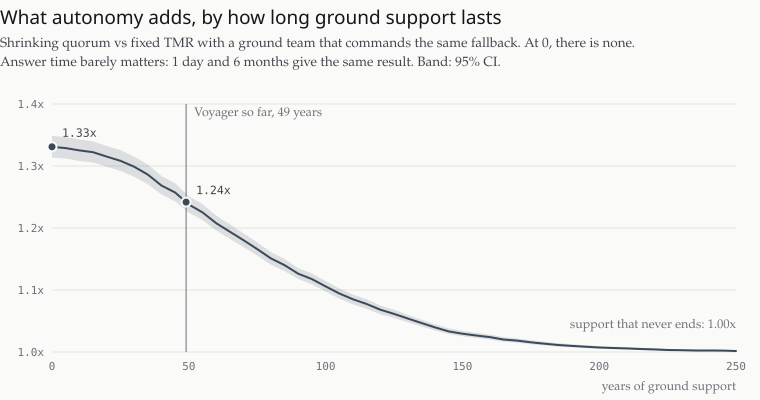
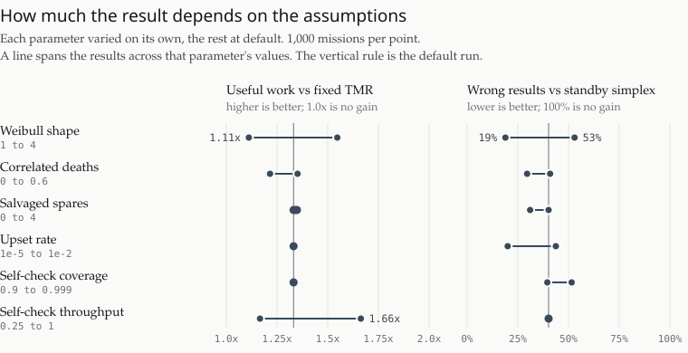

<p align="center">
  <a href="https://mru.space">
    <picture>
      <source media="(prefers-color-scheme: dark)" srcset="https://mru.space/assets/readme/mru-github-dark.gif">
      
    </picture>
  </a>
</p>

# dusk

A Monte Carlo of redundancy policies on hardware that only ever decays. Part of
[Mru](https://mru.space).

Classic triple modular redundancy [[1]](#references)[[2]](#references) has a fixed threshold. Three processors vote,
two can still detect a disagreement, and one cannot outvote anything, so the
system stops. On a mission with no repairs and no ground team in reach, that
throws away the last processor's whole remaining life.

The Mru whitepaper [[3]](#references) proposes a **shrinking quorum** instead: vote while
three processors are alive, compare while two are, and self-check on one.
Degrading from TMR to simplex is textbook [[4]](#references). The question here is what it
is worth when no ground team can command it. This program asks what that buys
and what it costs, on the same simulated hardware.

**Interactive version: [dusk.mru.space](https://dusk.mru.space)**

## Results

<picture>
  <source media="(prefers-color-scheme: dark)" srcset="docs/output-dark.svg">
  
</picture>

The shrinking quorum matches fixed TMR while three processors survive. It
pulls ahead as TMR starts to stop, and it keeps working long after. The shaded
area is the number that matters: total useful work across the whole decline.

Default parameters, 10,000 missions, seed 1:

```
policy              useful      p10      p50      p90      service   wrong days
                    mean y                                  mean y   mean / run
fixed TMR             99.0     37.6     92.7    168.9         99.0        0.000
standby simplex       83.1     38.4     78.3    134.0        166.4        0.603
shrinking quorum     132.6     64.3    126.6    208.3        166.4        0.246

shrinking quorum vs fixed TMR: 1.34x the useful work in total (95% CI 1.33x to 1.35x); per mission median 1.27x (p10 1.00x, p90 2.33x)
shrinking quorum vs standby simplex: 160% of the useful work, 41% of the wrong results (95% CI 40% to 42%)
break-even: fixed TMR comes out ahead only if one wrong result costs more than 136 years of useful work (95% CI 131 to 142)
```

- **Against fixed TMR:** 1.34x the useful work (95% CI 1.33x to 1.35x). Never
  less on any single mission, because the two policies are identical until TMR
  stops. The cost is a small number of wrong results in the single-processor
  tail, which TMR never lives long enough to produce.
- **The price of those wrong results:** TMR comes out ahead only if one wrong
  result costs more than **136 years** of useful work (95% CI 131 to 142).
- **Against standby simplex:** the same service life, 1.6x the useful work, and
  59% fewer wrong results (95% CI 58% to 60%), because it votes for as long as
  it has hardware to vote with.

Intervals are from a paired bootstrap [[11]](#references): 2,000 resamples of whole missions.

### When the ground can help

Real spacecraft do not run TMR alone. When a string fails, a ground team
diagnoses it and commands a fallback by hand. Voyager, launched in 1977, still
has that team: it now switches off instruments to live within a power supply
that falls about 4 watts a year [[5]](#references). Interstellar Probe is designed to last
at least 50 years [[6]](#references). `--ground` adds that baseline:
TMR that, once it loses its majority, is switched to self-checking simplex by
the ground after some delay, as long as ground support still exists.

<picture>
  <source media="(prefers-color-scheme: dark)" srcset="docs/ground-dark.svg">
  
</picture>

```
ground support ends        1 day   30 days  180 days   95% CI at 30 days
at launch                  1.34x     1.34x     1.34x   1.33x to 1.35x
after 10 years             1.33x     1.33x     1.33x   1.33x to 1.34x
after 25 years             1.31x     1.31x     1.31x   1.30x to 1.32x
after 50 years             1.25x     1.25x     1.25x   1.24x to 1.25x
after 100 years            1.11x     1.11x     1.11x   1.10x to 1.11x
after 200 years            1.01x     1.01x     1.01x   1.01x to 1.01x
never                      1.00x     1.00x     1.00x   1.00x to 1.00x
```

- **Answer time barely matters.** A fallback 1 day or 6 months after it is
  needed gives the same result to two decimals. The lost days are small next
  to decades of single-processor life.
- **What matters is whether anyone is still there.** With ground support that
  never ends, autonomy adds nothing to throughput: the ground does the same
  thing by hand. The whole gain comes from the years after support ends. At
  Voyager's 49 years so far, it is still 1.25x.

These years are relative to the hardware: with a 125-year Weibull scale, the
median processor lives about 98 years. Shorter-lived hardware moves the curve
left.

<picture>
  <source media="(prefers-color-scheme: dark)" srcset="docs/sensitivity-dark.svg">
  
</picture>

`--sweep` varies each parameter the model cannot pin down. Across every row,
the shrinking quorum returned **1.11x to 1.68x** the useful work of fixed TMR
and **47% to 82% fewer** wrong results than standby simplex. The work gain is
largest with early, random failures (Weibull shape 1) and smallest with sharp
wear-out (shape 4), where all three processors tend to die close together and
there is little tail left to use.

<details>
<summary>Full sweep output (the numbers behind the chart)</summary>

```
10000 missions per row, seed 1; unlisted parameters at their defaults

varied                        work vs TMR  wrong/mission wrong vs simplex
shape 1                             1.56x          0.399            53%
shape 1.5                           1.34x          0.246            41%
shape 2.5                           1.19x          0.151            28%
shape 4                             1.11x          0.091            18%
p_corr 0                            1.35x          0.267            42%
p_corr 0.1                          1.34x          0.246            41%
p_corr 0.3                          1.30x          0.201            38%
p_corr 0.6                          1.22x          0.123            31%
spares 0                            1.34x          0.246            41%
spares 1                            1.35x          0.231            37%
spares 2                            1.35x          0.223            34%
spares 4                            1.34x          0.216            31%
p_upset 1e-5                        1.34x          0.002            33%
p_upset 1e-4                        1.34x          0.026            43%
p_upset 1e-3                        1.34x          0.246            41%
p_upset 1e-2                        1.34x          2.461            41%
coverage 0.9                        1.34x          2.489            41%
coverage 0.99                       1.34x          0.246            41%
coverage 0.999                      1.34x          0.025            40%
self-check throughput 0.25          1.17x          0.246            41%
self-check throughput 0.5           1.34x          0.246            41%
self-check throughput 1             1.68x          0.246            41%
```

At `p_upset 1e-5` there are only about 20 wrong results across all 10,000
missions, so the 33% in that row is noisy. Treat it as a rough figure.

</details>

## Running it

```sh
cargo run --release                 # the default scenario
cargo run --release -- --spares 2   # add salvaged processors
cargo run --release -- --sweep      # sensitivity across uncertain parameters
cargo run --release -- --ground     # against TMR with a ground team
cargo run --release -- --help       # every option
cargo run --release --bin charts    # redraw the charts in docs/
cargo test --release
```

No dependencies. On an 8-core laptop the default run takes about 2 seconds,
`--ground` about 10, and `--sweep` about 30.
Results depend only on the seed, never on the thread count.

The charts are plain SVG, written by `src/bin/charts.rs` from the same seeds as
the tables above, in a light and a dark version styled after
[mru.space](https://mru.space). Nothing is drawn by hand. Curves are monotone
cubics [[12]](#references), which cannot overshoot the data.

The page at [dusk.mru.space](https://dusk.mru.space) is `docs/index.html`,
served by GitHub Pages. It draws the same charts live from `docs/data.json`,
which `charts` also writes, so the page and the README never disagree.

## The model

Each mission is a day-by-day fault-injection run [[7]](#references).

**Processors die** on a Weibull lifetime [[8]](#references). Shape 1.5 and a 125-year scale give
a median life of about 98 years.

**Deaths can be correlated** [[9]](#references). With probability `p_corr`, a death also kills one
other processor in service that day, and that death can do the same. This is a
stand-in for a shared thermal or power fault, or one particle shower hitting
neighbours.

**Spares are salvaged.** With `--spares N`, N more processors belong to
instruments. Each joins the pool when its instrument dies, but it has aged in
the same radiation since launch, so it can die before it is ever used. Both
TMR and the shrinking quorum use spares; simplex swaps them in as standbys.

**Upsets corrupt a day's result.** Each processor, each day, has a `p_upset`
chance of a transient fault that gets past EDAC and scrubbing. That is far
rarer than the raw bit-flip rate, and it is the number that matters here.

**The policies:**

| Live processors | Fixed TMR | Standby simplex | Shrinking quorum |
|---|---|---|---|
| 3 or more | vote, masks one upset | one self-checks | vote, masks one upset |
| 2 | compare, loses the day on any upset | one self-checks | compare, loses the day on any upset |
| 1 | **stops for good** | self-checks | self-checks |

TMR + ground fallback behaves like fixed TMR, except that on one processor it
idles until the ground's command arrives and then self-checks. If support has
already ended when TMR loses its majority, no command comes and it stops.

A self-checking processor catches a fraction `coverage` of its upsets and loses
those days. The rest become **wrong results**: output nobody knew was bad. It
also runs at `selfcheck_throughput` of full rate, because checking yourself
means doing the work twice.

**Useful work** is days of correct output, weighted by throughput and summed
over the whole mission: the accomplishment measure performability analysis
uses for systems that degrade [[10]](#references).

**The comparison is paired.** Every policy runs against the same fault history
and the same upsets, drawn from keyed hashes rather than a shared stream. Any
difference between policies is the policy.

## What this does not claim

The parameters are **illustrative, not calibrated.** They are plausible
orders of magnitude, not values fitted to flight data or radiation test
results. That is why the sweep exists: the claim is the shape of the trade,
and the sweep shows where it holds.

Other simplifications:

- A day is the unit of work. Nothing inside a day is modelled.
- Two or more upsets in a vote are always caught as a split. A real voter can
  be fooled by identical wrong answers, so this slightly flatters every voting
  policy equally.
- Power, thermal limits, and duty cycling are not modelled. Every processor
  runs every day.
- The ground team in `--ground` is perfect: it always diagnoses correctly and
  its command always works. Real anomaly response is slower and less certain,
  so this baseline flatters the ground.

## Citing

```bibtex
@software{binns2026dusk,
  author = {Binns, Will},
  title  = {dusk: A Monte Carlo of Redundancy Policies on Hardware That Only Ever Decays},
  year   = {2026},
  url    = {https://github.com/mruspace/dusk},
  note   = {Results at https://dusk.mru.space}
}
```

GitHub's "Cite this repository" button reads the same from `CITATION.cff`.

## References

1. R. E. Lyons and W. Vanderkulk, "The Use of Triple-Modular Redundancy to Improve Computer Reliability," *IBM Journal of Research and Development*, vol. 6, no. 2, pp. 200–209, 1962.
2. J. von Neumann, "Probabilistic Logics and the Synthesis of Reliable Organisms from Unreliable Components," in *Automata Studies*, C. E. Shannon and J. McCarthy, Eds. Princeton University Press, 1956, pp. 43–98.
3. W. Binns, "Mru: A Fault-Tolerant Operating System for Thousand-Year Autonomous Operation," 2026. [doi:10.5281/zenodo.20579438](https://doi.org/10.5281/zenodo.20579438)
4. D. P. Siewiorek and R. S. Swarz, *Reliable Computer Systems: Design and Evaluation*, 3rd ed. A K Peters, 1998.
5. NASA Jet Propulsion Laboratory, "NASA Turns Off 2 Voyager Science Instruments to Extend Mission," March 5, 2025. [jpl.nasa.gov](https://www.jpl.nasa.gov/news/nasa-turns-off-two-voyager-science-instruments-to-extend-mission/)
6. P. C. Brandt, E. A. Provornikova, et al., "Interstellar Probe: Humanity's Exploration of the Galaxy Begins," *Acta Astronautica*, vol. 199, pp. 364–373, 2022. [doi:10.1016/j.actaastro.2022.07.011](https://doi.org/10.1016/j.actaastro.2022.07.011)
7. M.-C. Hsueh, T. K. Tsai, and R. K. Iyer, "Fault Injection Techniques and Tools," *Computer*, vol. 30, no. 4, pp. 75–82, 1997.
8. W. Weibull, "A Statistical Distribution Function of Wide Applicability," *Journal of Applied Mechanics*, vol. 18, no. 3, pp. 293–297, 1951.
9. A. Avižienis, J.-C. Laprie, B. Randell, and C. Landwehr, "Basic Concepts and Taxonomy of Dependable and Secure Computing," *IEEE Transactions on Dependable and Secure Computing*, vol. 1, no. 1, pp. 11–33, 2004.
10. J. F. Meyer, "On Evaluating the Performability of Degradable Computing Systems," *IEEE Transactions on Computers*, vol. C-29, no. 8, pp. 720–731, 1980.
11. B. Efron, "Bootstrap Methods: Another Look at the Jackknife," *The Annals of Statistics*, vol. 7, no. 1, pp. 1–26, 1979. [doi:10.1214/aos/1176344552](https://doi.org/10.1214/aos/1176344552)
12. F. N. Fritsch and R. E. Carlson, "Monotone Piecewise Cubic Interpolation," *SIAM Journal on Numerical Analysis*, vol. 17, no. 2, pp. 238–246, 1980. [doi:10.1137/0717021](https://doi.org/10.1137/0717021)

## Questions or contributions

Issues and PRs aren't open to the public on this repo, but we'd love to hear from
you. Email [contact@mru.space](mailto:contact@mru.space).

## Licence

Code under [Apache License 2.0](./LICENSE). The **Mru** name and mark are
trademarks; see [TRADEMARK.md](./TRADEMARK.md).
